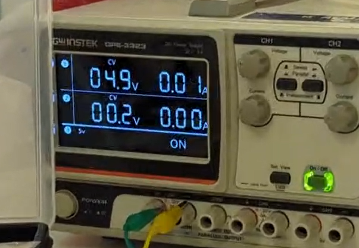

# 📚 Documentación del Proyecto Final

---

# 1) Resumen

- ## **Nombre del proyecto:** Tabla_Balancin
- ## **Equipo / Autor(es):** Alessandro Reyes, Sebastián Cortes, Leonardo LLaca
- ## **Curso / Asignatura:** Introduccion a la mecatronica 
- ## **Fecha:** 05/Dic/2025  
- ## **Descripción breve**: El proposito de este proyecto es lograr que una pelota se balancee sobre una superficia plana, utilizando herramientas como servomotores, programacion y modelados que priorizen la funcionalidad de este proyecto.

# -----------------------------------

# 2) Objetivos

## **General:** 
## Balancear una pelota de goma sobre una base.
## **Específicos:** 
## - Diseñar la base con los parametros adecuados para que en ningun momento se presenten problemas fisicos.
## - Escribir un codigo en Python que cumpla con las especificaciones necesarias para que pueda funcionar el proposito principal. 
## - Utilizar herramientas como Impresion 3D y Corte laser para generar eficiencia en el modelado de la base.
## - Medir, Probar, y mejorar el rendimiento de la base para que su funcionamiento llegue al maximo potencial posible.

## **Documentación:**
## El proposito de la documentacion de este proyecto es poder dar instrucciones claras para que cualquiera con los materiales y maquinas necesarias pueda recrear este proyecto a partir de lo se ve en este documento.

# -----------------------------------

# 3) Alcance y Exclusiones

## **Incluye:**
### - Instrucciones paso a paso para la elaboración del proyecto. 
### - medidas de cada pieza utilizada para el ensamblaje de la base fisica.
### - Codigo escrito en Python (Para probar la base).
### - Codigo escrito en Python (Finalizado y funcional).
### - Informacion completa acerca de materiales y programación.
### - Evidencias en fisico y digital enfocadas en el proceso.

## - **No incluye:** 
### 

# -----------------------------------

# 4) Requisitos

## **Componentes** 
##  - 3 × Servomotores ___
### - 1 × Resistencia R1 = ___
### - 1 ×  = ___
### - 1 × Capacitor electrolítico C1 = ___
### - 1 × Protoboard
### - Fuente de alimentación (5–9 VDC)
### - Jumpers o Cable
## **Material Para Ensamble**
### - Filamento PLA para impresion 3D.
### - MDF 2.5mm para corte laser.
### - Maquina de Corte Laser
### - Impresora 3D
## **Programación**
### - Instalar y Configurar Python (En su versión _____ )
### - CATIAV5 (para el modelado de las piezas)
### - UltiMaker (para la impresion de las piezas)        
## **Conocimientos previos y necesarios**
### - Conexion Basica de los componentes mencionados previamente.
### - Utilizacion de la Fuente de Alimentación.
### -

# -----------------------------------
# 5) Procedimiento Paso a Paso (Ensamblaje Fisico)

## **5.1) Modelado e Impresión y Corte de las piezas para Ensamble**

## Soporte Inicial
#### (Requisitos: CATIA V5, Filamento PLA)
### El soporte inicial es aquel en el que se insertaran los 3 servomotores, y la superficie donde se iran montando las piezas posteriores a esta.
### (A continuacion se mostrara una ilustracion en referencia a el soporte)

# 6) Procedimiento Paso a Paso (Conexion Electronica y Programación)

### (Una vez todos los requisitos se cumplan, proceder a esta seccion de la guia para Programar y Conectar el circuito completo)

# -----------------------------------

# 7) Resultados

## ✅ LED parpadea dentro del rango esperado (aprox. 9.3 s de periodo total).
## ✅ El comportamiento práctico coincide con las fórmulas.
## ✅ El 555 demostró ser un generador confiable de pulsos de baja frecuencia.

## **Evidencias del resultado final:**
### Figura 3. Montaje físico – Vista 1

### Figura 4. Montaje físico – Vista 2
