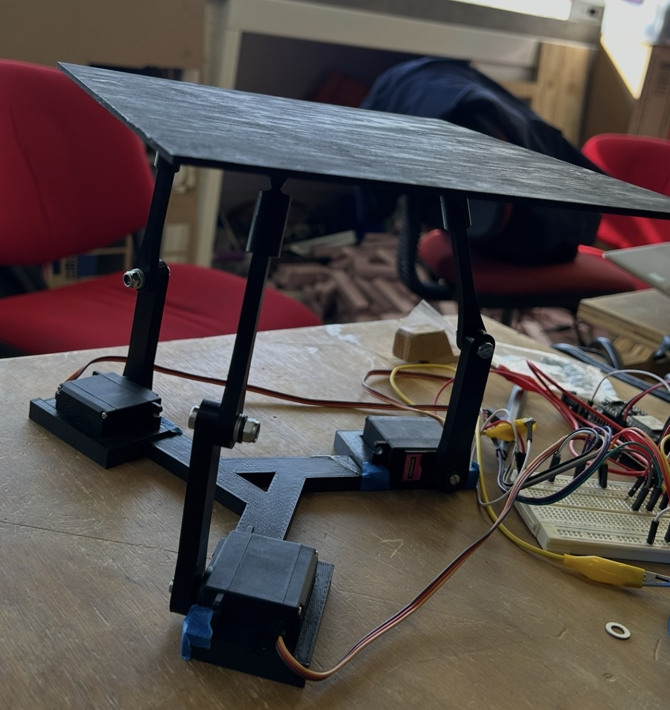

# 📚 Documentación del Proyecto Final

---

# 1) Resumen

- ## **Nombre del proyecto:** Tabla_Balancin
- ## **Equipo / Autor(es):** Alessandro Reyes, Sebastián Cortes, Leonardo LLaca
- ## **Curso / Asignatura:** Introduccion a la mecatronica 
- ## **Fecha:** 05/Dic/2025  
- ## **Descripción breve**: El proposito de este proyecto es lograr que una pelota se balancee sobre una superficia plana, utilizando herramientas como servomotores, programacion y modelados que priorizen la funcionalidad de este proyecto.

# -----------------------------------

# 2) Objetivos

## **General:** 
## Balancear una pelota de goma sobre una base.
## **Específicos:** 
## - Diseñar la base con los parametros adecuados para que en ningun momento se presenten problemas fisicos.
## - Escribir un codigo en Python que cumpla con las especificaciones necesarias para que pueda funcionar el proposito principal. 
## - Utilizar herramientas como Impresion 3D y Corte laser para generar eficiencia en el modelado de la base.
## - Medir, Probar, y mejorar el rendimiento de la base para que su funcionamiento llegue al maximo potencial posible.

## **Documentación:**
## El proposito de la documentacion de este proyecto es poder dar instrucciones claras para que cualquiera con los materiales y maquinas necesarias pueda recrear este proyecto a partir de lo se ve en este documento.

# -----------------------------------

# 3) Alcance y Exclusiones

## **Incluye:**
## - Instrucciones paso a paso para la elaboración del proyecto. 
## - medidas de cada pieza utilizada para el ensamblaje de la base fisica.
## - Codigo escrito en Python (Para probar la base).
## - Codigo escrito en Python (Finalizado y funcional).
## - Informacion completa acerca de materiales y programación.
## - Evidencias en fisico y digital enfocadas en el proceso.

# -----------------------------------

# 4) Requisitos

## **Componentes** 
## - 1 x ESP 32 
## - 3 × Servomotores MG996R
## - 1 × Protoboard
## - Fuente de alimentación (6V - 2A)
## - Jumpers o Cable 

## **Material Para Ensamble**
## - Filamento PLA para impresion 3D.
## - MDF 2.5mm para corte laser.
## - Maquina de Corte Laser
## - Impresora 3D
## - x9 Arandelas
## - x3 Tuercas

## **Programación**
## - Instalar y Configurar Python (En su versión 3.12 )
## - Instalar ARDUINO
## - CATIAV5 (para el modelado de las piezas)
## - UltiMaker (para la impresion de las piezas)   

## **Conocimientos previos y necesarios**
## - Conexion Basica de los componentes mencionados previamente.
## - Utilizacion de la Fuente de Alimentación.

# -----------------------------------
# 5) Procedimiento Paso a Paso (Ensamblaje Fisico)

## 5.1) Modelado e Impresión y Corte de las piezas para Ensamble

#### ("Dentro de el siguiente archivo se podran encontrar las piezas impresas en 3D guardadas como archivos de CATIA V5")
#### https://drive.google.com/drive/folders/1URrUiXQX4pFFJv3180PdhCvuy02d2yeR?usp=drive_link

### 5.1.1) **Soporte Inicial**
#### (Requisitos: CATIA V5, Filamento PLA)
#### (Cantidad: x1)

### El soporte inicial es aquel en el que se insertaran los 3 servomotores y donde se soporta todo el ensamble. 
### la pieza tiene como proposito sostener los servomotores fijos a ella ante cualquier movimiento que hagan

### "(El Soporte Inicial y sus medidas exactas se encuentran en el link de drive bajo el mismo nombre de pieza.)"

## //////////////////////////////

### 5.1.2) **Brazo Grueso**
#### (Requisitos: CATIA V5, Filamento PLA)
#### (Cantidad: x3)

### El brazo Grueso es aquel que se inserta en el centro de cada servo motor.
### La pieza tiene como proposito ser parte del movimiento que balancea la pelota en la superficie final.
### Esta pieza estara conectada con otra similar a ella, pero es importante que no se utilize el modelo de este brazo para el otro, ya que tienen ciertas diferencias que permiten que accionen correctamente.

### "(El Brazo Grueso y sus medidas exactas se encuentran en el link de drive bajo el mismo nombre de pieza.)"

#### ("Medidas")
#### (Ancho: 7mm  )
#### (Alto: 150mm ) 

## //////////////////////////////

### 5.1.3) **Brazo Delgado**
#### (Requisitos: CATIA V5, Filamento PLA)
#### (Cantidad: x3)

### El brazo Delgado es aquel que se junta con el brazo grueso a partir del agujero superior.
### La pieza tiene como proposito insertarse en los cilindros conectados a la base plana.
### Con esta pieza se logra conectar el movimiento de los servomotores con la base plana, permitiendo que el balanceo sea posible.

### "(El Cilindro y sus medidas exactas se encuentran en el link de drive bajo el mismo nombre de pieza.)"

#### ("Medidas")
#### (Ancho: 7mm  )
#### (Alto: 150mm ) 

## //////////////////////////////

### 5.1.4) **Cilindro**
#### (Requisitos: CATIA V5, Filamento PLA)
#### (Cantidad: x3)

### El cilindro es aquella pieza que va pegada a la base plana y donde se inserta el brazo delgado
### La pieza tiene como proposito permitir que todas las piezas esten conectadas entre si e interactuen para generar el proposito del proyecto.
### Esta pieza nos permite encajar el movimiento de nuestros brazos a una superficie, habilitando el objetivo principal

### "(El Cilindro y sus medidas exactas se encuentran en el link de drive bajo el mismo nombre de pieza.)"


## //////////////////////////////

### 5.1.5) **Base Plana**
#### (Requisitos: MDF 2.5 mm )
#### (Cantidad: x1)

### La base plana es aquella pieza que permite que el balanceo de la pelota sea posible, finalizando la ultima parte del ensamble
### La pieza tiene como proposito coincidir con los movimientos emitidos por los brazos.
### Esta pieza nos permite encajar el movimiento de nuestros brazos a una superficie, habilitando el objetivo principal

#### ("Medidas")
#### (Ancho: 220mm )
#### (Alto:  220mm ) 


## 5.2) Ensamblaje de las piezas

### Una vez cortadas e impresas las piezas, es momento de ensamblar


#### (primera ilustracion de guia para ensamblaje)

### 1. Como se puede observar en la imagen, cada uno de los servomotores deben ser insertados en la base plana, es importante que todos queden ajustados a presion, y en caso de que tengan complicaciones, es recomendable insertar pijas para mantenerlo fijo.

### 2. Posteriormente a esto, el brazo grueso de igual manera debe ser insertado a presion en el servomotor, hasta que ambas piezas se muevan simultaneamente, de igual manera es posible utilizar tornillos si llega a haber movimiento inesperado


#### (Segunda Ilustracion de guia para ensamblaje)

### 3. Una vez colocado el brazo grueso, colocar el Brazo delgado Paralelo a la pieza, y utilizando 3 arandelas, colocarlas entre los brazos, para posteriormente insertar una tornillo y fijarlo con una tuerca para que no haya inestabilidad en el movimiento de los brazos.


#### (Tercera Ilustracion de guia para ensamblaje)

### 4. Finalmente, inserta el cilindro en la parte superior de el brazo delgado, y asegurate de que esta pieza vaya pegada a tu base plana

# -----------------------------------


# 6) Procedimiento Paso a Paso (Conexion Electronica y Programación)

## (Una vez todos los requisitos se cumplan, proceder a esta seccion de la guia para Programar y Conectar el circuito completo)

### Ya con python instalado, Conecta tu ESP32 con la placa de expansion, junto con los 3 servo motores conectados a la esp para señal
### (Todo esto conectado a una fuente externa a 6V - 2A)

### Ya vinculada tu ESP32 a tu computadora, ejecuta primero el siguiente codigo en ARDUINO

```cpp
#include "BluetoothSerial.h"
 
BluetoothSerial SerialBT;
String device_name = "ESP32_PROYECTO_FINAL";
 
// --- PINES ---
const int PIN_S1 = 18; // Amarillo (Izq)
const int PIN_S2 = 19; // Verde (Abajo)
const int PIN_S3 = 21; // Rojo (Der)
 
// --- CONFIGURACIÓN ---
const int ANG_BASE = 50;  
const int ANG_MIN  = 50;  
const int ANG_MAX  = 110;  
 
// --- PID ---
float kp = 0.15;  
float ki = 0.0;
float kd = 0.40;
 
float lastErrorX = 0, cumErrorX = 0;
float lastErrorY = 0, cumErrorY = 0;
float angS1 = ANG_BASE, angS2 = ANG_BASE, angS3 = ANG_BASE;
 
void moverServo(int pin, int angulo) {
  if (angulo < ANG_MIN) angulo = ANG_MIN;
  if (angulo > ANG_MAX) angulo = ANG_MAX;
  int pulso = 500 + ((long)angulo * 1900) / 180;
  digitalWrite(pin, HIGH);
  delayMicroseconds(pulso);
  digitalWrite(pin, LOW);
}
 
void setup() {
  Serial.begin(115200);
  SerialBT.begin(device_name);
  Serial.println("BLUETOOTH LISTO. EJE X CORREGIDO");
 
  pinMode(PIN_S1, OUTPUT); pinMode(PIN_S2, OUTPUT); pinMode(PIN_S3, OUTPUT);
 
  // Saludo
  moverServo(PIN_S2, 80); delay(400);
  moverServo(PIN_S2, ANG_BASE);
}
 
void loop() {
  // Refresco constante
  moverServo(PIN_S1, (int)angS1);
  moverServo(PIN_S2, (int)angS2);
  moverServo(PIN_S3, (int)angS3);
  delay(15);
 
  if (SerialBT.available()) {
    String packet = SerialBT.readStringUntil('\n');
    float inX, inY, inP, inI, inD;
    int n = sscanf(packet.c_str(), "%f,%f,%f,%f,%f", &inX, &inY, &inP, &inI, &inD);
 
    if (n == 5) {
      kp = inP; ki = inI; kd = inD;
 
      // PID X
      float errorX = inX;
      cumErrorX = constrain(cumErrorX + errorX, -200, 200);
      float outputX = (errorX * kp) + (cumErrorX * ki) + ((errorX - lastErrorX) * kd);
      lastErrorX = errorX;
 
      // PID Y
      float errorY = inY;
      cumErrorY = constrain(cumErrorY + errorY, -200, 200);
      float outputY = (errorY * kp) + (cumErrorY * ki) + ((errorY - lastErrorY) * kd);
      lastErrorY = errorY;
 
      // === CINEMÁTICA CORREGIDA ===
     
      // S2 (Abajo): Pitch puro.
      float targetS2 = ANG_BASE + (outputY * 1.0);
 
      // AQUÍ ESTABA EL ERROR: He invertido los signos de outputX.
      // Antes S1 tenía "+ outputX", ahora tiene "- outputX".
      // Antes S3 tenía "- outputX", ahora tiene "+ outputX".
      float targetS1 = ANG_BASE + (-outputY * 0.5) - outputX;
      float targetS3 = ANG_BASE + (-outputY * 0.5) + outputX;
 
      angS1 = constrain(targetS1, ANG_MIN, ANG_MAX);
      angS2 = constrain(targetS2, ANG_MIN, ANG_MAX);
      angS3 = constrain(targetS3, ANG_MIN, ANG_MAX);
    }
  }
}
```

### El siguiente codigo es el que se ejecuta para ajustar el PID de la base
#### Los valores ya estan predeterminados y deberan ser dejados asi para este caso especifico.

### A continuacion el codigo final en Python.

```cpp
import cv2
import numpy as np
import serial
import time
import math
 
# --- CONFIGURACIÓN ---
PUERTO = 'COM19'  
BAUD   = 115200
 
# Conexión
ser = None
try:
    ser = serial.Serial(PUERTO, BAUD, timeout=0.1, write_timeout=0)
    print(f"✅ CONECTADO A {PUERTO}")
    time.sleep(2)
except Exception as e:
    print(f"❌ Error Bluetooth: {e}")
 
# CÁMARA (Índice 1)
cap = cv2.VideoCapture(2, cv2.CAP_DSHOW)
 
# --- RANGOS PELOTA ---
rojo_bajo1 = np.array([0, 120, 70]); rojo_alto1 = np.array([10, 255, 255])
rojo_bajo2 = np.array([170, 120, 70]); rojo_alto2 = np.array([180, 255, 255])
 
# --- VARIABLES ---
last_send_time = 0
SEND_INTERVAL = 0.08
prev_ball_center = None
 
# Variables de "Memoria" para la base
last_plate_center = None
frames_lost = 0 # Contador de cuadros perdidos
 
def nothing(x): pass
 
# --- VENTANA AJUSTES ---
cv2.namedWindow("AJUSTES")
cv2.resizeWindow("AJUSTES", 400, 400)
 
cv2.createTrackbar("Kp (x100)", "AJUSTES", 22, 300, nothing)
cv2.createTrackbar("Kd BASE (x100)", "AJUSTES", 45, 300, nothing)
cv2.createTrackbar("Turbo Freno", "AJUSTES", 15, 50, nothing)
 
# VISIÓN: Empezamos con un valor alto para aceptar grises
cv2.createTrackbar("Umbral Negro", "AJUSTES", 100, 255, nothing)
 
print("SISTEMA LISTO. 'q' para salir.")
 
while True:
    ret, frame = cap.read()
    if not ret: break
    frame = cv2.resize(frame, (640, 480))
 
    # Leer Sliders
    base_kp = cv2.getTrackbarPos("Kp (x100)", "AJUSTES") / 100.0
    base_kd = cv2.getTrackbarPos("Kd BASE (x100)", "AJUSTES") / 100.0
    turbo   = cv2.getTrackbarPos("Turbo Freno", "AJUSTES") / 10.0
    thresh  = cv2.getTrackbarPos("Umbral Negro", "AJUSTES")
 
    # ==========================================
    # 1. DETECCIÓN DE BASE (ESTRATEGIA "MANCHA GIGANTE")
    # ==========================================
    gray = cv2.cvtColor(frame, cv2.COLOR_BGR2GRAY)
    blurred = cv2.GaussianBlur(gray, (5, 5), 0) # Poco blur para no perder bordes
   
    # Umbral Invertido (Negro -> Blanco)
    _, mask_plate = cv2.threshold(blurred, thresh, 255, cv2.THRESH_BINARY_INV)
   
    # Rellenar agujeros (Reflejos)
    kernel = cv2.getStructuringElement(cv2.MORPH_RECT, (25, 25))
    mask_plate = cv2.morphologyEx(mask_plate, cv2.MORPH_CLOSE, kernel)
   
    # Limpiar ruido pequeño
    mask_plate = cv2.erode(mask_plate, None, iterations=2)
    mask_plate = cv2.dilate(mask_plate, None, iterations=2)
   
    cnts_plate, _ = cv2.findContours(mask_plate, cv2.RETR_EXTERNAL, cv2.CHAIN_APPROX_SIMPLE)
   
    current_plate_center = None
   
    if len(cnts_plate) > 0:
        # Tomamos SOLO el objeto más grande. No importa si es cuadrado o amorfo.
        c_plate = max(cnts_plate, key=cv2.contourArea)
       
        # Si es suficientemente grande, lo aceptamos como base
        if cv2.contourArea(c_plate) > 20000:
            M = cv2.moments(c_plate)
            if M["m00"] != 0:
                current_plate_center = (int(M["m10"] / M["m00"]), int(M["m01"] / M["m00"]))
               
                # Dibujamos lo que detectamos
                rect = cv2.minAreaRect(c_plate)
                box = np.int64(cv2.boxPoints(rect))
                cv2.drawContours(frame, [box], 0, (0, 255, 0), 2)
                cv2.circle(frame, current_plate_center, 5, (0, 255, 0), -1)
               
                # Actualizamos la memoria
                last_plate_center = current_plate_center
                frames_lost = 0
   
    # SISTEMA DE MEMORIA (ANTI-PARPADEO)
    if current_plate_center is None:
        frames_lost += 1
        # Si perdimos la base por menos de 10 cuadros (0.3 seg), usamos la última posición
        if last_plate_center is not None and frames_lost < 10:
            current_plate_center = last_plate_center
            cv2.putText(frame, "MEMORIA ACTIVA", (10, 450), cv2.FONT_HERSHEY_SIMPLEX, 0.7, (0, 165, 255), 2)
        else:
            cv2.putText(frame, "BASE PERDIDA", (10, 450), cv2.FONT_HERSHEY_SIMPLEX, 0.7, (0, 0, 255), 2)
 
    # ==========================================
    # 2. PELOTA Y CONTROL
    # ==========================================
    if current_plate_center is not None:
        hsv = cv2.cvtColor(frame, cv2.COLOR_BGR2HSV)
        mask_ball = cv2.add(cv2.inRange(hsv, rojo_bajo1, rojo_alto1), cv2.inRange(hsv, rojo_bajo2, rojo_alto2))
        mask_ball = cv2.erode(mask_ball, None, iterations=2)
        mask_ball = cv2.dilate(mask_ball, None, iterations=2)
       
        cnts_ball, _ = cv2.findContours(mask_ball, cv2.RETR_EXTERNAL, cv2.CHAIN_APPROX_SIMPLE)
       
        if len(cnts_ball) > 0:
            c_ball = max(cnts_ball, key=cv2.contourArea)
            ((x, y), radio) = cv2.minEnclosingCircle(c_ball)
           
            if radio > 8:
                ball_center = (int(x), int(y))
               
                # Velocidad
                velocity = 0
                if prev_ball_center is not None:
                    dx = ball_center[0] - prev_ball_center[0]
                    dy = ball_center[1] - prev_ball_center[1]
                    velocity = math.sqrt(dx*dx + dy*dy)
                prev_ball_center = ball_center
 
                # Turbo
                final_kd = base_kd + (velocity * turbo / 10.0)
               
                # Visualización
                cv2.circle(frame, ball_center, int(radio), (0, 255, 255), 2)
                cv2.line(frame, current_plate_center, ball_center, (0, 255, 0), 2)
               
                # Error (Usando el centro actual o memorizado)
                error_x_raw = x - current_plate_center[0]
                error_y_raw = y - current_plate_center[1]
               
                val_x = int(np.interp(error_x_raw, [-200, 200], [-50, 50]))
                val_y = int(np.interp(error_y_raw, [-200, 200], [-50, 50]))
               
                # Envío
                if ser and ser.is_open and (time.time() - last_send_time > SEND_INTERVAL):
                    try:
                        msg = f"{val_x},{val_y},{base_kp:.2f},{0:.2f},{final_kd:.2f}\n"
                        ser.write(msg.encode())
                        last_send_time = time.time()
                       
                        cv2.putText(frame, f"TX: {val_x},{val_y}", (10, 30),
                                    cv2.FONT_HERSHEY_SIMPLEX, 0.6, (0, 255, 0), 2)
                    except: pass
        else:
            prev_ball_center = None
 
    # Muestra la máscara para que calibres
    cv2.imshow("Mascara Base (Blanco=OK)", mask_plate)
    cv2.imshow("Vision Control", frame)
 
    if cv2.waitKey(1) & 0xFF == ord('q'): break
 
cap.release()
cv2.destroyAllWindows()
if ser: ser.close()
```

### Ambos codigos permiten el funcionamiento del Balancin con la condicion de que todos los pasos del ensamblaje y la parametrizacion de las impresiones haya sido la correcta.


# -----------------------------------

# 7) Resultados y Evidencias Finales

### Si todos los pasos se siguieron de la manera correcta, el resultado final deberia ser exacto o muy similar al del siguiente video.

### EVIDENCIA

https://youtube.com/shorts/88SjHziDrIY?feature=share

